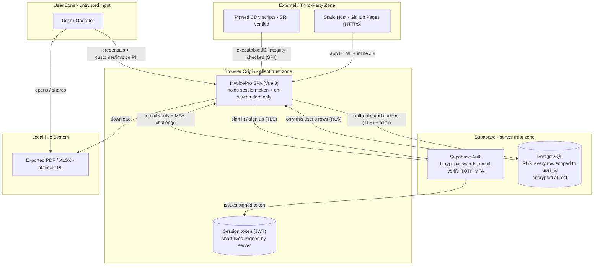

# InvoicePro — Threat Model & Security Baseline (v2, post-remediation)

**Document type:** Application threat model / security assessment — "after" model
**Subject:** InvoicePro — invoicing web app (Vue 3 front-end + Supabase backend)
**Assessment date:** Captured after the backend migration and hardening work
**Methodology:** STRIDE threat modelling + OWASP Top 10 (2021) mapping
**Status of this version:** Post-remediation ("after"). This is the companion to the v1 baseline ("before"); finding IDs are kept identical so each item can be traced from one document to the other.

> **Purpose of this document.** The v1 baseline recorded the app as originally built — a single browser origin holding the password, the encryption key, and all plaintext data together, pulling executable code from six external sources with no integrity checking. This v2 model re-draws the system around its new server boundary and walks the findings register from **Open → Remediated**, stating honestly what is fixed, what is reduced, and what remains open. Read alongside v1, the two show the security journey rather than just a snapshot.

---

## 1. Scope & methodology

**In scope:** the client-side application; the Supabase backend (authentication, database, row-level access control); the connection between them; third-party script dependencies; multi-factor authentication; and the data handled.

**Out of scope (for this model):** payment processing and automated email sending (not yet built); formal data-protection compliance work (tracked separately — see §7). Hosting is in scope only as static file delivery via GitHub Pages.

**Approach.** Unchanged from v1: decompose the system into a data-flow diagram with trust boundaries, examine each element against the six STRIDE categories, rate findings qualitatively (`Likelihood × Impact`), and map to OWASP Top 10 (2021). The risk-rating scale is identical to v1.

---

## 2. System description (post-remediation)

InvoicePro is now a **two-tier application**: a Vue 3 front-end delivered as static files, and a managed backend (**Supabase**) providing authentication, a PostgreSQL database, and access control. The defining change from v1 is that **a real trust boundary now exists between the browser and the server** — the most valuable assets no longer all live in one place.

**Authentication now works like this:**
- Accounts use **Supabase Auth**. Passwords are never stored or handled by the app; they are hashed server-side with **bcrypt** (a slow, salted password hash).
- **Email verification is real** — a server-sent confirmation link must be clicked before an account can be used.
- On sign-in the server issues a short-lived signed token (a **JWT**) that proves identity for the session; the app never holds the password as a key.
- **Multi-factor authentication (TOTP)** is available: a user can enrol an authenticator app, after which a rotating 6-digit code is required at login. This was verified end-to-end, including confirming that an incorrect code is refused.

**Data now works like this:**
- All business data (company profile, customers, saved items, invoices) is stored in **PostgreSQL on Supabase**, not in the browser.
- Every row carries the owning user's ID, and **Row Level Security (RLS)** enforces, inside the database, that a user can only ever read or change their own rows. This was verified by a direct break-test (querying all rows returned only the tester's own).
- Data is **encrypted in transit (TLS/HTTPS)** and **at rest** by the platform.
- The browser holds only the session token and the working copy of data on screen — not the password, and not other users' data.

**Front-end integrity:**
- All third-party libraries are **pinned to exact versions** and loaded with **Subresource Integrity (SRI)** hashes, so altered code is refused by the browser.
- A **Content-Security-Policy (CSP)** restricts which sources may run scripts or open connections.
- The styling library is **self-hosted** rather than loaded live from an external tool, removing one external dependency.

**Data handled (unchanged from v1):** customer names, addresses, phone numbers, emails, tax IDs, notes, invoice line items and amounts, plus the operator's own company details and account email. All PII / commercially sensitive under UK GDPR.

---

## 3. Data-flow diagram (post-remediation)

The single most important change from v1: **the password, the durable data, and the access-control decision now live server-side, behind an authenticated boundary** — not in the browser origin alongside the third-party code.

---

## 4. Assets & trust boundaries (post-remediation)

**Assets, in priority order:**
1. The **account password** — now never held by the app and never used as an encryption key; only ever sent over TLS to the server, where it is bcrypt-hashed.
2. The **session token (JWT)** — proves identity for the session; short-lived and server-signed.
3. The **database contents** — all customer PII and financial data, now server-side, encrypted at rest, and access-controlled per user.
4. **Integrity** of the front-end code (CDN scripts) — now integrity-checked via SRI.
5. **Availability** of the data — now durably stored server-side (with the durability caveat in F-09).

**Trust boundaries:**
- **TB-1 User → SPA:** all user input remains untrusted (unchanged).
- **TB-2 SPA → Supabase Auth/DB (the new server boundary):** the central addition. Authentication and access-control decisions happen here, server-side, not in the browser. **This is the boundary that did not exist in v1.**
- **TB-3 SPA → CDNs:** third-party code — now integrity-checked (SRI) and version-pinned. No longer the highest-risk boundary.
- **TB-4 Host → SPA:** static delivery of the app (unchanged).

The v1 "single undivided trust zone" no longer describes the system: credential handling, key custody, durable storage, and authorisation have all moved across TB-2 to the server.

---

## 5. STRIDE analysis (post-remediation)

| STRIDE | Element | Status after remediation | Residual rating |
|---|---|---|---|
| **S**poofing | Auth (TB-1/TB-2) | Real server-side identity: bcrypt-hashed passwords, server-sent email verification, optional TOTP MFA. Client-side "fake" verification removed. | Low |
| **S**poofing | CDN (TB-3) | Scripts pinned + SRI-verified; an impersonated/altered script is refused by the browser. | Low |
| **T**ampering | Data store (TB-2) | Data in PostgreSQL behind authenticated, RLS-scoped queries; no malleable client-side ciphertext. Integrity handled by the platform. | Low |
| **T**ampering | CDN code (TB-3) | **Was Critical.** SRI now blocks modified scripts from executing. | Low |
| **T**ampering | Browser storage | No password or vault in browser storage; only a short-lived signed token. Token tampering breaks its signature and is rejected. | Low |
| **R**epudiation | Whole app | Supabase records authentication events. Application-level audit trail of edits/exports/deletions still not implemented. | Low / Info (see F-11) |
| **I**nfo disclosure | Password storage | **Was High.** Passwords no longer stored by the app at all; server-side bcrypt (salted, slow). | Low |
| **I**nfo disclosure | Key derivation | **Was High.** Client-side vault removed entirely; no weak KDF remains. At-rest encryption handled by the platform. | Low |
| **I**nfo disclosure | Data at rest (TB-2) | **Was High.** Data moved off the browser into encrypted, access-controlled server storage. | Low |
| **I**nfo disclosure | Memory | Password no longer retained as a long-lived key; only transiently during sign-in. | Low |
| **I**nfo disclosure | Exports / logo | Logos can now be uploaded and embedded locally (no external fetch required), closing the IP/referer leak for that path. Exported PDF/XLSX remain plaintext PII on the user's own disk — inherent to the feature. | Low |
| **D**enial of service | Durable data | Data now in durable server storage rather than only `localStorage`. Formal backup/restore still to be defined (free-tier). | Low–Medium (see F-09) |
| **E**levation of privilege | Origin / code execution | Blast radius reduced: SRI + CSP limit injected/altered code; the password and other users' data are no longer present in the origin to steal. | Low–Medium |
| **E**levation of privilege | Multi-user isolation | RLS enforces per-user data access in the database; one user cannot reach another's rows even by crafting direct queries. | Low |

---

## 6. Findings register (Open → Remediated)

Same IDs as v1, so each line can be traced across the two documents.

| ID | Finding (from v1) | v1 Rating | OWASP 2021 | Status now | How it was addressed |
|---|---|---|---|---|---|
| F-01 | Third-party scripts without SRI / version pinning | Critical | A06 / A08 | **Remediated** | Exact version pinning + SRI hashes on all libraries; CSP added; styling library self-hosted to cut an external dependency |
| F-02 | Unsalted single-round SHA-256 passwords | High | A02 | **Remediated** | Replaced with Supabase Auth; passwords bcrypt-hashed server-side; app never stores password material |
| F-03 | Weak vault key derivation (MD5/1-iteration) | High | A02 | **Remediated (by design)** | Client-side vault removed; data in PostgreSQL with TLS in transit + encryption at rest |
| F-04 | No real email verification → spoofing | High | A07 | **Remediated** | Server-sent email confirmation required before an account is usable |
| F-05 | Secrets/PII in browser `localStorage`/memory | High | A04 / A02 | **Remediated** | Data held server-side behind authenticated, row-scoped queries; browser holds only a short-lived token |
| F-06 | No authenticated encryption on vault (no MAC) | Medium | A02 | **Remediated (by design)** | Client-side vault removed; platform handles at-rest encryption and integrity |
| F-07 | No multi-tenant isolation | Medium | A01 | **Remediated & verified** | PostgreSQL Row Level Security scopes every query to the authenticated user; confirmed by a direct break-test |
| F-08 | No password policy / no MFA | Medium | A07 | **Partially remediated** | TOTP MFA implemented and verified (incl. wrong-code rejection). Password-strength/breach checks at sign-up still to add; MFA backup recovery codes not yet issued |
| F-09 | No data backup / durability | Medium | A04 (availability) | **Partially remediated** | Data now in durable server storage rather than only the browser. Formal, documented backup/restore not yet defined (free-tier hosting) |
| F-10 | No CSP / security headers | Medium | A05 | **Remediated (with caveats)** | CSP added. `'unsafe-eval'` permitted (required by in-browser template compilation) — a documented trade-off. Frame-protection (clickjacking) header not settable on the current static host |
| F-11 | No audit logging (repudiation) | Low / Info | A09 | **Open** | Supabase auth logs exist; application-level audit trail of edits/exports/deletions not yet built (relevant as multi-user usage grows) |
| F-12 | External logo leak; plaintext exports | Low | A04 (privacy) | **Partially remediated** | Local logo upload (embedded) removes the external-fetch IP/referer leak. Exported files remain plaintext on the user's own disk — inherent to the export feature |
| F-13 | Misleading security claims | High (trust/legal) | A04 / misrepresentation | **Remediated** | UI copy describes only what the app actually does; security report documents real controls and honest limitations |

**Summary of movement:** of the 13 findings, the two highest-severity (F-01 Critical; F-02/F-03/F-04/F-05 High) are fully remediated, as are F-06 and F-13. F-07 is remediated and independently verified. F-08, F-09, F-10 and F-12 are remediated to a meaningful degree with clearly-stated residual items. F-11 remains open and is appropriately low priority at the current scale.

---

## 7. Compliance note (UK GDPR / DPA 2018)

The v1 caveat now applies in full: because data is stored server-side and the app is capable of serving multiple users, the operator would, on taking real subscribers, become a data **controller** (for accounts) and **processor** (for subscribers' customer PII). The obligations listed in v1 §7 stand — lawful basis, truthful privacy policy, Data Processing Agreement, data-subject rights (access/erasure/portability/rectification), 72-hour breach notification, ICO registration, and keeping card data out of scope via a payment provider if payments are added. None of these are yet implemented, and they are tracked separately from this technical model. *This is engineering guidance, not legal advice; obtain professional review before taking paying users.*

---

## 8. Post-remediation summary

The v1 baseline's defining weakness was a single, undivided trust zone. The defining characteristic of v2 is the opposite: **a real server boundary now separates credentials, durable data, and authorisation from the browser**, with defence in depth layered on top — verified identity (with optional MFA), database-enforced per-user isolation, encryption in transit and at rest, integrity-checked dependencies, and a browser content policy.

The migration was therefore not a feature upgrade but the core security remediation, exactly as v1 anticipated. Measured against the findings register, the project has moved the great majority of items from **Open → Remediated**, with the genuinely-remaining work (application audit logging, formal backups, password-strength and MFA recovery codes, and the compliance groundwork for real users) identified honestly rather than overlooked. Stating those residual items plainly is itself part of a credible security posture: the goal of this exercise was never to claim perfection, but to make the system's real protections — and its real limits — visible and traceable.
