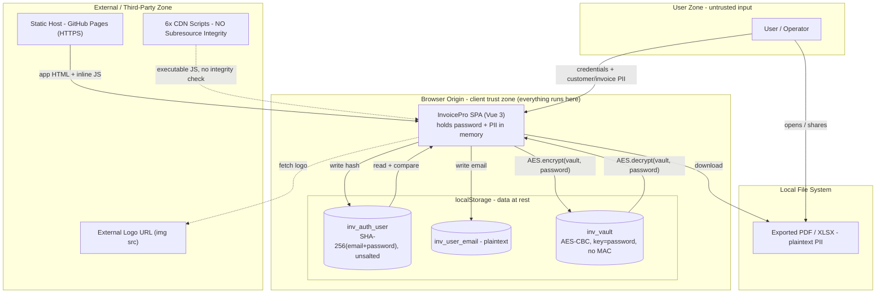

# InvoicePro — Threat Model & Security Baseline (v1)

**Document type:** Application threat model / security assessment baseline
**Subject:** InvoicePro — single-file, client-side invoicing web app (Vue 3, no backend)
**Assessment date:** Baseline captured prior to backend migration
**Methodology:** STRIDE threat modelling + OWASP Top 10 (2021) mapping
**Status of this version:** Pre-remediation baseline ("before"). A matching "after" document will be produced once the Supabase backend and hardening controls are in place.

> **Purpose of this document.** This is the *before* snapshot for a deliberate before/after security exercise. It records the architecture and threats of the app as originally built, so that each weakness can be tracked through to remediation. It is written against the app **as it was**, including the one item already fixed (misleading security claims), which is marked accordingly so the trail is honest.

---

## 1. Scope & methodology

**In scope:** the client-side application, its authentication and "vault" encryption logic, its browser storage, its third-party script dependencies, and the data it handles.

**Out of scope (for this baseline):** the future Supabase backend, payment processing, and hosting infrastructure beyond static file delivery — these are addressed in the "after" model.

**Approach.** The system is decomposed into a data-flow diagram (DFD) with trust boundaries. Each element (external entity, process, data store, data flow) is examined against the six STRIDE categories — Spoofing, Tampering, Repudiation, Information disclosure, Denial of service, Elevation of privilege. Findings are then rated and mapped to OWASP Top 10 (2021) for industry reference.

**Risk rating.** Qualitative `Likelihood × Impact`:

| Rating | Meaning |
|---|---|
| Critical | Easy to exploit, leads to full compromise of credentials or all stored PII |
| High | Realistic path to disclosure/compromise of sensitive data |
| Medium | Exploitable under specific conditions, or meaningfully weakens a control |
| Low | Limited impact or requires unlikely preconditions |
| Info | Not a vulnerability itself; design note or compliance flag |

---

## 2. System description (baseline)

InvoicePro is a **single HTML file** running entirely in the user's browser. There is **no server and no database**. Vue 3, Tailwind, jsPDF, html2canvas, SheetJS and crypto-js are loaded from public CDNs.

**"Accounts" work like this:**
- On registration, the app computes `SHA-256(email + password)` and stores it in `localStorage` under `inv_auth_user`. Email is stored in plaintext under `inv_user_email`.
- A 6-digit "email verification" code is generated **in the browser** and shown in a pop-up; it is not sent anywhere.
- On login, the app re-computes the hash and compares strings. On match, the **plaintext password is held in memory** as `encryptionKey`.
- All business data (company profile, customers, saved items, invoices) is serialised to JSON and stored under `inv_vault` as `CryptoJS.AES.encrypt(json, password)` — i.e. the password itself is the encryption passphrase.

**Data handled (all PII / commercially sensitive under UK GDPR):** customer names, postal addresses, phone/mobile numbers, email addresses, tax IDs, free-text notes, plus invoice line items and amounts, and the operator's own company details and account email/password.

---

## 3. Data-flow diagram

Trust boundaries are the subgraph borders. The single most important observation: **everything of value — the password, the decryption key, the plaintext PII, and the third-party code — lives inside one browser origin with no isolation between them.**

---

## 4. Assets & trust boundaries

**Assets (what an attacker wants), in priority order:**
1. The account **password** — it is simultaneously the login secret *and* the vault encryption key, so it unlocks everything.
2. The **`inv_vault` ciphertext** — all customer PII and financial data.
3. The **`inv_auth_user` hash** — enables offline password cracking.
4. **Integrity** of the app code (the 6 CDN scripts) — controlling any of them controls the whole app.
5. **Availability** of the local data (no backup exists).

**Trust boundaries crossed:**
- **TB-1 User → SPA:** all user input is untrusted.
- **TB-2 SPA → localStorage:** data at rest, readable by *any* script on the origin.
- **TB-3 SPA → CDNs:** third-party code executed with full origin privileges. **Highest-risk boundary.**
- **TB-4 Host → SPA:** static delivery of the app itself.

---

## 5. STRIDE analysis

| STRIDE | Element | Threat in this app | Rating |
|---|---|---|---|
| **S**poofing | Auth (TB-1) | No real identity proof. The "email verification" code is generated client-side and shown to the user, so email ownership is never verified — anyone can register any email. | High |
| **S**poofing | CDN (TB-3) | If a CDN is compromised or impersonated, malicious code runs as the trusted app and can spoof the UI/login. | High |
| **T**ampering | Vault (TB-2) | AES-CBC is used with **no message authentication (no MAC)**. Ciphertext is malleable; tampering is not detected, only surfaced as a generic "failed to decrypt". | Medium |
| **T**ampering | CDN code (TB-3) | Scripts are loaded **without Subresource Integrity (SRI)**. A modified script (CDN breach or MITM) executes with full privileges and can read the password and exfiltrate the vault. | Critical |
| **T**ampering | localStorage (TB-2) | Any XSS or local access can overwrite stored hash/vault. | Medium |
| **R**epudiation | Whole app | No logging or audit trail of any kind. No record of logins, edits, exports, or deletions. Acceptable for a personal tool; unacceptable once multi-tenant. | Low (Info for SaaS) |
| **I**nfo disclosure | Password storage | `SHA-256(email+password)`, **unsalted and single-round**, is a fast hash unsuitable for passwords. If read, it is cheaply brute-forced/rainbow-tabled offline. | High |
| **I**nfo disclosure | Vault key derivation | crypto-js derives the AES key from the passphrase via OpenSSL `EVP_BytesToKey` (**MD5, one iteration**). Weak KDF → fast offline brute-force of the password against the ciphertext. | High |
| **I**nfo disclosure | Data at rest (TB-2) | Hash, email and vault sit in `localStorage`, readable by any JS on the origin and by anyone with device/file access. Email is plaintext. | High |
| **I**nfo disclosure | Memory | Plaintext password held in several variables (`encryptionKey`, `pendingAuth.password`, `auth.password`); recoverable via XSS or dev tools. | Medium |
| **I**nfo disclosure | Exports / logo | XLSX/PDF exports are plaintext PII on disk; external logo URL leaks the user's IP/referer to a third party. | Low |
| **D**enial of service | Local data | `localStorage` can be cleared by the browser/user, and "forgot password" forces a full wipe. **No backup = permanent data loss.** | Medium |
| **E**levation of privilege | Single origin | There is no privilege separation: UI code, crypto, key material and data share one context. Any code execution (XSS/supply-chain) = total compromise. | High |
| **E**levation of privilege | Shared device | One account per browser; anyone using that browser who knows/guesses the password gets full access. No session expiry. | Medium |

---

## 6. Findings register

IDs are stable so they can be referenced in the "after" document. **Status** tracks the before/after journey.

| ID | Finding | Rating | OWASP 2021 | Status | Planned remediation |
|---|---|---|---|---|---|
| F-01 | Third-party scripts loaded without SRI / version pinning (supply-chain RCE) | **Critical** | A06 Vulnerable & Outdated Components / A08 Integrity Failures | Open | Pin versions, add SRI hashes, add a Content-Security-Policy `<meta>`; reduce CDN count where practical |
| F-02 | Passwords stored as unsalted single-round SHA-256 | **High** | A02 Cryptographic Failures | Open | Replace with server-side auth (Supabase) using a proper password hash (bcrypt/Argon2) — app never stores password hashes again |
| F-03 | Weak vault key derivation (crypto-js MD5/1-iteration KDF) | **High** | A02 Cryptographic Failures | Open | Remove client-side vault; data moves to Postgres with TLS in transit + encryption at rest. If any client crypto remains, use WebCrypto + PBKDF2/Argon2 with high iteration count |
| F-04 | No real email verification (client-side code) → account/identity spoofing | **High** | A07 Identification & Auth Failures | Open | Supabase Auth email confirmation (server-sent token) |
| F-05 | Sensitive data + key material in browser-accessible `localStorage`/memory | **High** | A04 Insecure Design / A02 | Open | Data held server-side behind authenticated, row-scoped queries; tokens in secure storage; minimise client-held secrets |
| F-06 | No authenticated encryption on vault (AES-CBC, no MAC) | **Medium** | A02 Cryptographic Failures | Open | N/A after migration (server-side at-rest encryption). If client crypto remains, use AES-GCM |
| F-07 | No multi-tenant isolation; single account per browser | **Medium** | A01 Broken Access Control | Open | Postgres Row Level Security so every query is scoped to the authenticated user |
| F-08 | No password policy on registration (length/complexity) | **Medium** | A07 Identification & Auth Failures | Open | Enforce policy + breach-password check at sign-up; consider TOTP MFA |
| F-09 | No data backup / durability; "forgot password" = total loss | **Medium** | A04 Insecure Design (availability) | Open | Durable Postgres storage + export; documented retention |
| F-10 | No CSP or security headers; large XSS blast radius | **Medium** | A05 Security Misconfiguration | Open | CSP, `X-Content-Type-Options`, referrer policy (meta where host can't set headers) |
| F-11 | No audit logging (repudiation) | **Low / Info** | A09 Logging & Monitoring Failures | Open | Supabase auth logs + app-level audit trail on sensitive actions once multi-user |
| F-12 | External logo URL leaks IP/referer; XLSX/PDF exports are plaintext PII | **Low** | A04 Insecure Design (privacy) | Open | Self-host uploaded logos (Supabase Storage); warn on export |
| F-13 | App misrepresented its security ("end-to-end", "zero-knowledge", "AES-256 vault", "GDPR") | **High** (trust/legal) | A04 Insecure Design / misrepresentation | **Remediated** | UI copy rewritten to describe what the app actually does; claims will be re-introduced only when true and verifiable |

---

## 7. Compliance note (UK GDPR / DPA 2018)

In its current local-only form, the app performs no server-side processing, so most operator obligations are dormant. **This changes the moment data is stored server-side and offered to other users.** At that point the operator becomes a data **controller** (for subscriber accounts) and **processor** (for subscribers' customer PII), triggering: lawful basis, a truthful privacy policy, a Data Processing Agreement with subscribers, data-subject rights (erasure/access/portability/rectification), breach notification (72h), ICO registration, and — if payments are added — keeping card data out of scope via a payment provider. These are tracked separately in the compliance checklist, not in this technical model. *This is engineering guidance, not legal advice; obtain professional review before taking paying users.*

---

## 8. Baseline summary

The defining characteristic of v1 is **a single, undivided trust zone**: one browser origin holds the code, the key, the password and the plaintext data together, and pulls executable code from six external sources with no integrity checking. The cryptography present (crypto-js vault, SHA-256 auth) provides a *feeling* of protection but uses weak, fast, unauthenticated primitives that do not withstand offline attack — and the most valuable secret (the password) is reused as both auth credential and encryption key.

The migration to a real backend is therefore not a feature upgrade but the core security remediation: it introduces the trust boundaries, access control, proper credential handling and durability that a system holding third-party PII requires. Progress will be measured by walking the findings register from **Open → Remediated**, with the "after" threat model re-drawn around the new server boundary.
